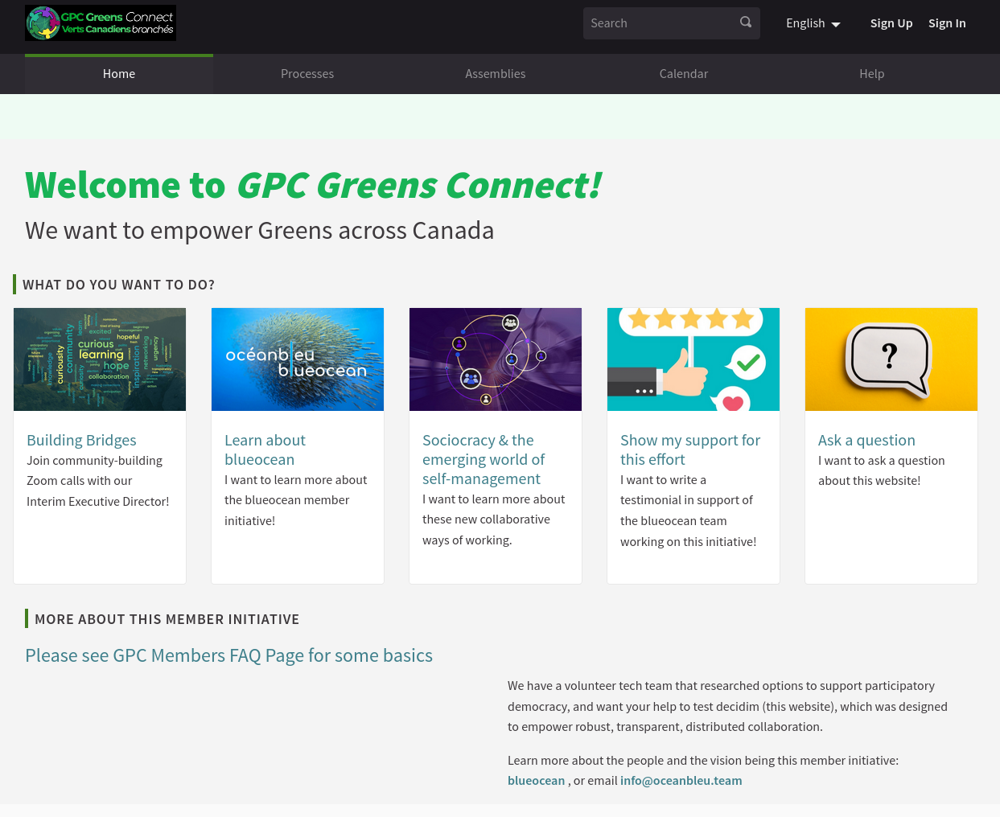

# Decidim for the Green Party Canada

Free Open-Source participatory democracy, citizen participation and open government for cities and organizations

This is the open-source repository for https://gpcmembers.com based on [Decidim](https://github.com/decidim/decidim).




## Deploying the app

This is a [Ruby on Rails](https://rubyonrails.org/) application packaged with Docker. It can be deployed into a Docker (or a Docker Swarm) environment with the usual commands:

```bash
docker-compose up -d
```

To update between commit, you can force the build:

```bash
docker-compose up -d --build
```

To enter the container and run commands, you can use (you need to have the container running):

```bash
docker-compose exec app bash
```

Once inside, you can run Rails/rake command as usual:

```bash
bin/rails db:migrate:status
```

Or enter the Rails console:

```bash
bin/rails c
```

Note that some ENV vars are dedicated to the Docker environment. Please check the [entrypoint.sh](entrypoint.sh) for details.
Mainly, you can specify if you want to run the Sidekiq worker or the Rails server with the `RUN_SIDEKIQ` ENV var. If not specified, defaults to false. Also the env `RUN_RAILS` is available to run the Rails server (defaults to true).

Finally, note that every time the container is started migrations are run. If you want to avoid this, you can use the `SKIP_MIGRATIONS` ENV var.

### ENV vars

These ENV vars modifies the behavior of the application in some ways:

| ENV | Description |
| --- | --- |
| `DONATE_BUTTON` | If present, it will show a button with the text "donate" linked to this url. Currently in the process sidebar and when creating a proposal. Locale can be handled with interpolations (ie: `http://some.thing/%{locale}/pay_here`) |
| `CHAT_BUTTON` | If present, it will show a button with the text "AGM Chat (beta)" linked to this url. Currently in the process sidebar. Locale can be handled with interpolations (ie: `http://some.thing/%{locale}/chat_here`) |
| `REDIRECT_SIGN_UP` | If present and sign up is enabled, it redirects user registration to the URL specified in it. Can process some variable interpolation like `%{locale}` that would be replace by the current users' locale |
| `REDIRECT_AFTER_INVITATION` | If present, it redirects users registered that registers using an internal invitation (not users registered without it) to the URL specified in this var. |
| `WATCH_RACE_IFRAME` | If present, it adds a menu named "Watch race! Live" and a page with and iframe pointing to whatever URL specified in this var. |
| `REDIRECT_HOMEPAGE` | If present, it makes homepage requests (ie `/`) to be redirected to whatever URL specified in this var. It also removes the main "home" menu item.  |
| `DISABLE_EXTERNAL_INVITES` | If present and set to non-empty value (ie `1`), it disables the ability to invite external participants to meetings |
| `QUESTIONNAIRE_NOTIFY_EMAILS` | Fill it with different emails, separated by spaces, to send each one of them a notification each time a questionnaire is submitted |
| `PROCESS_LEADERSHIP` | If defined, shows a menu directly to the process indicated (used when leadership race is on). Used to be `leadership` |
| `PROCESS_POLICY` | If defined, shows a menu directly to the process indicated. Use to be `Policy2021` |
| `ASSEMBLY_LEADERSHIP` | If defined, shows a menu directly to that assembly (used when leadership race is on). It also applies some custom design to the assembly children (each being an assembly contestant), particularly, it adds a "donate" button. Used to be `leadership-campaigns` |
| `ASSEMBLY_LEADERSHIP_EVENTS` | If defined, redirects the specified assembly to the first published component instead of showing the main info page of the assembly. Used to be `events` |
| `ENFORCE_ORIGINAL_AMENDMENTS_LOCALE` | If defined, when creating an amendment it will enforce users to do it in the same language as the original proposal |
| `CONTESTANTS_COMPONENTS` | IDs of components (separated by spaces) that will hold contestants. This applies a special design to the proposals page, removing filters for instance. It also adds a link to "donate" money to this particular candidate. |
| `ALWAYS_SHOW_DONATE_BUTTON` | if `true`, all proposals will show a generic donate button in the sidebar |
| `TRANSLATOR_API_KEY` | If defined, automatic translations are enabled. We use [DeepL API](https://www.deepl.com/pro-api) service, only api keys from there are valid |
| `TRANSLATOR_HOST` | The URL for the translator API. For the free service must be `https://api-free.deepl.com`. For the "pro" service is `https://api.deepl.com` |
| `CONFERENCE_{CONF_SLUG}_REGISTRATION` | If defined, it will replace the link to register into a conference by the one provided in this env var. Note that `{CONF_SLUG}` corresponds to the "slug" of the conference replacing any `-` hyphen with an `_` underscore. For instance a conference with the slug `gpc-2023` will expect an env var called `CONFERENCE_GPC_2023_REGISTRATION`. Also, language interpolation is available by substituing any string `%{locale}` by the current locale. |

Please refer to the private documentation repository for further details.

## Contributing

If you wan to contribute to this repository, please open a Pull Request and wait until the test pass.

In order to configure your environment for development, please install [RBENV](https://github.com/rbenv/rbenv) and (optionally but recommended) [RBENV-VARS](https://github.com/rbenv/rbenv-vars) and [PostgreSQL](https://www.postgresql.org/) in your own machine.

Then, make a copy of this repository, create a development instance with seeds and start your local application:

```bash
git clone git@github.com:Green-Party-of-Canada-Members/gpc-decidim.git
cd gpc-decidim
bundle install
bundle exec rake db:create db:migrate db:seed
bin/rails s
```

Visit: http://localhost:3000/
