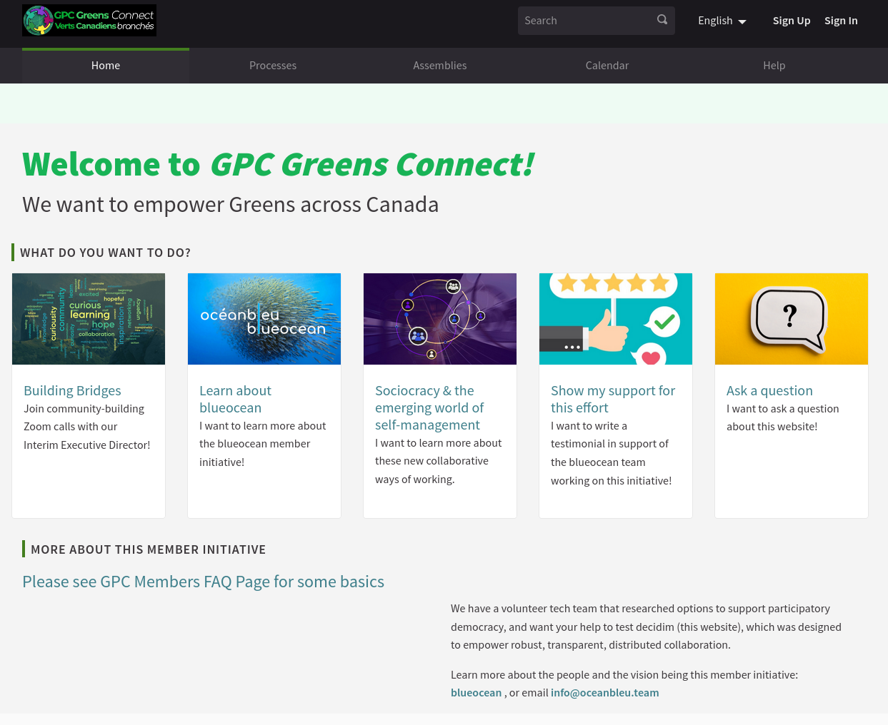

# Decidim for the Green Party Canada

Free Open-Source participatory democracy, citizen participation and open government for cities and organizations

This is the open-source repository for https://gpcmembers.com based on [Decidim](https://github.com/decidim/decidim).




## Deploying the app

Deployed with [Capistrano](http://capistranorb.com/) using [Figaro](https://github.com/laserlemon/figaro) for `ENV` configuration.

In your machine, execute:

```bash
cap production deploy
```

Please refer to the private documentation repository for details.

## Contributing

If you wan to contribute to this repository, please open a Pull Request and wait until the test pass.

In order to configure your enviroment for development, please install [RBENV](https://github.com/rbenv/rbenv) and (optionally but recommended) [RBENV-VARS](https://github.com/rbenv/rbenv-vars) and [PostgreSQL](https://www.postgresql.org/) in your own machine.

Then, make a copy of this repository, create a development instance with seeds and start your local application:

```bash
git clone git@github.com:Green-Party-of-Canada-Members/gpc-decidim.git
cd gpc-decidim
bundle install
bundle exec rake db:create db:migrate db:seed
bin/rails s
```

Visit: http://localhost:3000/
